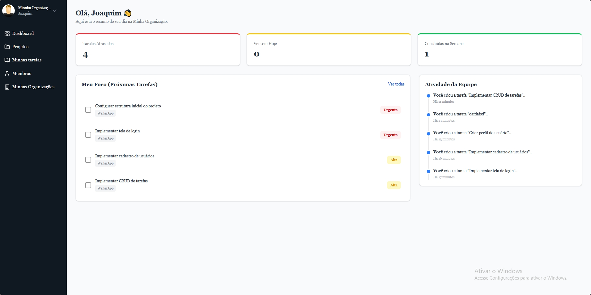
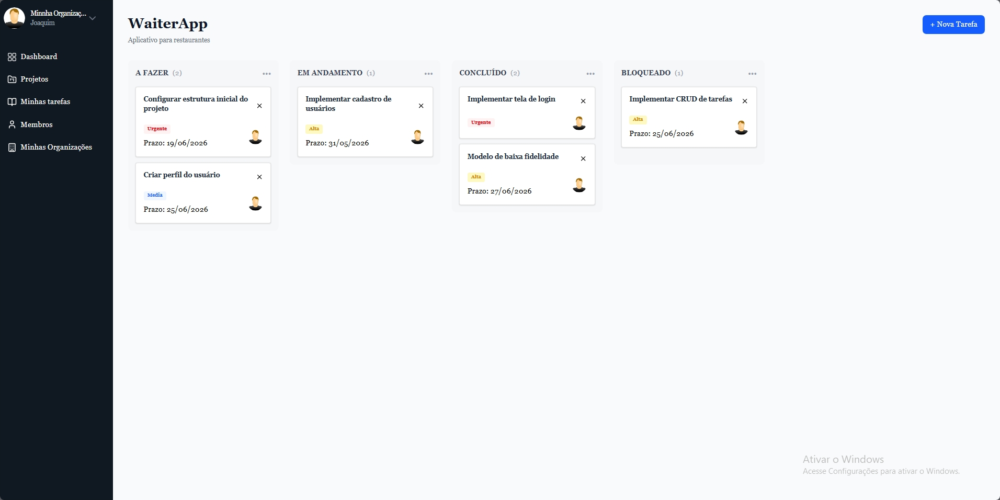
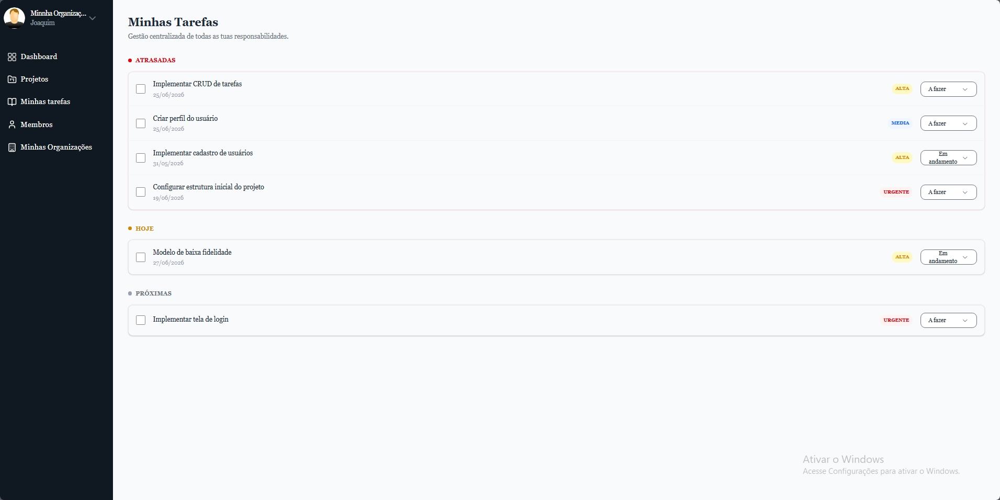
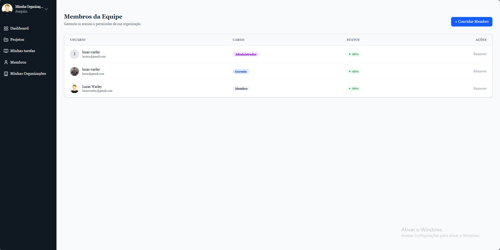

# 🚀 TeamBoard - Plataforma SaaS de Gestão de Projetos e Tarefas

O **TeamBoard** é uma aplicação Full Stack de gestão de tarefas e projetos inspirada em cenários reais de software corporativo. O sistema foi estruturado desde o início com foco em conceitos comuns em aplicações SaaS modernas, como autenticação segura, isolamento multi-tenant, controle de permissões (RBAC) e experiência fluida no frontend.

Mais do que um CRUD tradicional, este projeto foi utilizado como laboratório prático para estudar arquitetura backend, resiliência de rede, gerenciamento de estado complexo e decisões de engenharia aplicadas ao ecossistema TypeScript moderno.

---

# 📸 Visão Geral do Sistema

> *As interfaces foram construídas com foco em simplicidade, produtividade e boa experiência de uso.*

## Dashboard e Feed de Atividades

Painel principal com resumo de projetos recentes e histórico de ações realizadas pelos usuários.

* Projetos recentemente acessados
* Feed de auditoria legível
* Atualizações automáticas de atividade

<p align="center">
  
</p>

---

## Quadro Kanban

Sistema de gerenciamento visual de tarefas com drag and drop e atualização otimista no frontend.

<p align="center">
  
</p>

---

## Minhas Tarefas

Visão consolidada das tarefas do usuário entre diferentes projetos.

* Agrupamento automático por prazo
* Estado derivado no frontend
* Atualizações reativas com React Query

<p align="center">
  
</p>

---

## Gestão de Membros e Permissões

Painel administrativo para gerenciamento de membros da organização e permissões baseadas em papéis.

<p align="center">
  
</p>

---

# 🧠 Principais Conceitos Trabalhados

## Multi-tenancy e Isolamento de Dados

O sistema foi estruturado para suportar múltiplas organizações utilizando a mesma aplicação.

Cada requisição valida:

* Usuário autenticado
* Organização ativa
* Permissão de acesso ao recurso solicitado

Essa abordagem reduz riscos de acesso indevido entre organizações e evita problemas comuns relacionados a IDOR (*Insecure Direct Object Reference*).

---

## Idempotência e Resiliência de Rede

Requisições de escrita utilizam chaves de idempotência para evitar duplicações causadas por:

* cliques múltiplos
* falhas de conexão
* reenvio acidental de requisições

### Estratégia Atual do MVP

Nesta versão inicial, as chaves processadas são armazenadas em memória RAM no servidor da API.

Essa abordagem reduz complexidade operacional durante o MVP e mantém excelente performance local.

### Evolução Planejada

Em um ambiente distribuído, o ideal seria migrar essa estratégia para Redis ou outro mecanismo compartilhado.

---

## Autenticação e Controle de Permissões

### Dual Token Pattern

O sistema utiliza:

* Access Token em memória
* Refresh Token via Cookie HttpOnly

Essa abordagem reduz exposição do JWT em cenários de XSS.

### RBAC (Role-Based Access Control)

As permissões são controladas em duas camadas:

* Backend protegido via Guards do NestJS
* Frontend adaptando ações visíveis conforme o papel do usuário

Papéis atuais:

* Admin
* Manager
* User

---

## Optimistic Updates

No Kanban e nas listas de tarefas, a interface é atualizada imediatamente antes da resposta da API retornar.

Isso melhora significativamente a percepção de performance do sistema.

Caso ocorra erro:

* o estado visual realiza rollback automaticamente
* o cache é sincronizado novamente

---

## Feed de Atividades e Auditoria

O sistema registra ações importantes dos usuários para compor o painel de atividades.

Alterações em entidades relacionadas atualizam automaticamente o timestamp do projeto principal utilizando transações do Prisma.

O feed é montado dinamicamente durante as consultas, evitando joins excessivamente pesados no dashboard.

---

# 🛠️ Stack Tecnológica

## Backend

* Node.js
* NestJS
* TypeScript
* PostgreSQL
* Prisma ORM
* JWT
* Bcrypt
* class-validator
* class-transformer

## Frontend

* React
* Vite
* TypeScript
* Tailwind CSS
* Zustand
* TanStack Query
* @hello-pangea/dnd

---

# 📂 Estrutura Geral do Projeto

```bash
teamboard/
├── api/
│   ├── src/
│   │   ├── modules/
│   │   ├── shared/
│   │   ├── guards/
│   │   ├── services/
│   │   └── prisma/
│
├── frontend/
│   ├── src/
│   │   ├── components/
│   │   ├── pages/
│   │   ├── hooks/
│   │   ├── services/
│   │   └── store/
```

---

# ⚠️ Status Atual do Projeto

O TeamBoard ainda está em desenvolvimento ativo e possui pontos planejados para evolução técnica, incluindo:

* Refatoração de módulos mais extensos
* Expansão da cobertura de testes
* Reestruturação da pipeline de CI/CD
* Melhorias de observabilidade
* Otimizações de performance
* Redução de acoplamento em alguns fluxos

Apesar disso, o projeto já implementa diversos conceitos importantes de arquitetura backend e frontend modernos.

---

# 📌 Decisões Técnicas e Trade-offs

## Armazenamento de Idempotência em Memória

A escolha por armazenamento em memória foi feita para reduzir complexidade de infraestrutura durante o MVP.

Trade-off:

* Simplicidade operacional
* Performance local excelente
* Não ideal para múltiplas instâncias distribuídas

---

## Optimistic Updates

Melhoram bastante a experiência do usuário, porém aumentam a complexidade de sincronização e rollback visual.

---

## Commits e Histórico

O projeto passou por mudanças estruturais frequentes durante o desenvolvimento, o que resultou em commits maiores e menos frequentes em algumas etapas.

A organização incremental do histórico e melhorias na granularidade dos commits fazem parte da evolução contínua do projeto.

---

# 🚀 Como Executar o Projeto

## Pré-requisitos

* Node.js v18+
* PostgreSQL

---

## Backend

```bash
# Clone o repositório
git clone https://github.com/SEU_USUARIO/teamboard.git

# Entre na pasta do backend
cd teamboard/backend

# Instale as dependências
npm install

# Configure as variáveis de ambiente
cp .env.example .env

# Execute as migrations
npx prisma migrate dev

# Inicie o servidor
npm run start:dev
```

---

## Frontend

```bash
cd ../frontend

npm install

npm run dev
```

---

# 📚 Objetivos do Projeto

Este projeto foi desenvolvido principalmente para aprofundar conhecimentos em:

* Arquitetura Full Stack
* Segurança em aplicações web
* Modelagem relacional
* Gerenciamento de estado complexo
* Performance percebida no frontend
* Multi-tenancy
* Controle de permissões
* Boas práticas com TypeScript

---

# 🔮 Melhorias Futuras

* Integração com Redis
* Testes E2E completos
* Observabilidade com Grafana/OpenTelemetry
* Upload de arquivos
* Notificações em tempo real
* WebSockets
* Sistema de comentários
* Cobertura de testes ampliada
* Docker Compose completo
* Deploy automatizado

---

# 📄 Licença

Projeto desenvolvido para fins de estudo, portfólio e evolução técnica.
